<div align="center">

# cargo-clean-targets

**Strip Cargo `target/` caches across a whole tree, keep only the compiled binaries.**

<br/>



<br/>

[](https://crates.io/crates/cargo-clean-targets)
[](LICENSE)
[](https://www.rust-lang.org/)
[](#)
[](https://github.com/FGRibreau/cargo-clean-targets/actions/workflows/release.yml)

</div>

---

## What is this?

A tiny Cargo subcommand that walks a directory, finds every Cargo `target/` it can prove is one (`CACHEDIR.TAG` or `.rustc_info.json`), and removes the cache subtrees — `deps/`, `build/`, `incremental/`, `.fingerprint/`, `doc/`, dep-info `.d` files — while leaving the actually-compiled binaries (`release/app`, `debug/app`, examples, dylibs, rlibs, wasm) untouched.

Useful when you have a `~/code` folder full of half-built Rust projects eating tens of GB and you don't want to nuke `target/` whole because you want yesterday's release build to still run.

## Features

- **Walks recursively** — point it at any folder, it finds every Cargo target inside
- **Keeps the binaries** — executables, dylibs, rlibs, wasm stay; only cache goes
- **Safe detection** — only touches dirs marked by Cargo (`CACHEDIR.TAG` / `.rustc_info.json`)
- **Dry mode** — `--dry` previews directories that would be removed before doing anything
- **Verbose mode** — `--dry --verbose` lists every individual file too
- **Reclaim report** — final summary shows target dirs touched, paths removed, bytes freed
- **Cargo-native** — invokable as `cargo clean-targets` (single static binary, no runtime, no deps)

---

## Install

### Cargo

```bash
cargo install cargo-clean-targets
```

Then use it as a Cargo subcommand:

```bash
cargo clean-targets ~/code
```

### Homebrew (macOS / Linux)

```bash
brew tap FGRibreau/tap
brew install cargo-clean-targets
```

### `cargo binstall` (prebuilt binary, no compile)

```bash
cargo binstall cargo-clean-targets
```

### Prebuilt binaries

Grab a tarball/zip for your platform from [Releases](https://github.com/FGRibreau/cargo-clean-targets/releases). Targets shipped:

`x86_64-unknown-linux-gnu`, `aarch64-unknown-linux-gnu`, `x86_64-unknown-linux-musl`, `aarch64-unknown-linux-musl`, `x86_64-apple-darwin`, `aarch64-apple-darwin`, `x86_64-pc-windows-msvc`, `aarch64-pc-windows-msvc`.

### From source

```bash
git clone https://github.com/FGRibreau/cargo-clean-targets.git
cd cargo-clean-targets
cargo build --release
./target/release/cargo-clean-targets --dry ~/code
```

---

## Quick Start

```bash
# preview (recommended first run)
cargo clean-targets --dry ~/code

# do it
cargo clean-targets ~/code
```

You can also run the binary directly without going through Cargo:

```bash
cargo-clean-targets --dry ~/code
```

---

## Usage

```
cargo clean-targets [OPTIONS] <PATH>
cargo-clean-targets [OPTIONS] <PATH>
```

### Options

| Flag | Description |
|------|-------------|
| `-n`, `--dry` | Preview only — list directories (and root files of `target/`) that would be removed. Alias: `--dry-run` |
| `-v`, `--verbose` | Print every path acted on, including individual files inside cache subdirs |
| `-h`, `--help` | Show usage |

### Example

```bash
$ cargo clean-targets --dry ~/code
target: /Users/me/code/myproj/target
  would rm dir  /Users/me/code/myproj/target/release/.fingerprint  (12.04 MiB)
  would rm dir  /Users/me/code/myproj/target/release/incremental   (48.21 MiB)
  would rm dir  /Users/me/code/myproj/target/release/deps          (612.80 MiB)
  would rm dir  /Users/me/code/myproj/target/release/build         (4.10 MiB)

done: 1 target dir(s), 5 path(s) removed, 677.82 MiB freed (dry) (+1 file(s) not shown — pass --verbose to list)

Thanks for using cargo-clean-targets!
— François-Guillaume Ribreau ( https://fgribreau.com )
```

---

## What it keeps vs removes

| Inside `target/<profile>/` | Action |
|------|--------|
| Top-level executables (no ext, `.exe`) | **kept** |
| Dynamic libs (`.so`, `.dylib`, `.dll`) | **kept** |
| Static libs (`.a`, `.lib`, `.rlib`) | **kept** |
| WebAssembly (`.wasm`) | **kept** |
| `examples/` final binaries | **kept** |
| `deps/`, `build/`, `incremental/`, `.fingerprint/` | removed |
| `examples/{deps,build,incremental,.fingerprint}/` | removed |
| Top-level `.d`, `.rmeta`, `.pdb`, `.o`, `.obj` | removed |

| Inside `target/` | Action |
|------|--------|
| Profile dirs (`debug/`, `release/`, custom) | descended into |
| `doc/`, `package/`, `tmp/`, `.rustdoc_fingerprint/` | removed |
| `CACHEDIR.TAG`, `.rustc_info.json` | kept |

A directory is treated as a Cargo target only if it contains `CACHEDIR.TAG` or `.rustc_info.json`. A folder named `target/` that isn't actually one (e.g. some unrelated project's data dir) is left alone.

---

## Development

```bash
cargo build --release
cargo test
```

The binary is a single `src/main.rs` with no external dependencies — just `std`.

---

## Release pipeline

Releases are fully automated via three GitHub Actions workflows:

| Workflow | Trigger | Tool | Purpose |
|----------|---------|------|---------|
| `release-plz.yml` | push to `main` | [`release-plz`](https://github.com/release-plz/release-plz) | Open a release PR (version bump + changelog). Merging it tags + creates a GitHub Release + `cargo publish`. |
| `release.yml` | push of `v*` tag | [`taiki-e/upload-rust-binary-action`](https://github.com/taiki-e/upload-rust-binary-action) | Cross-compile 8 targets and upload tarballs/zips to the GitHub Release. |
| `homebrew-bump.yml` | release published | [`dawidd6/action-homebrew-bump-formula`](https://github.com/dawidd6/action-homebrew-bump-formula) | Open a PR on [`FGRibreau/homebrew-tap`](https://github.com/FGRibreau/homebrew-tap) bumping the formula. |

### Required GitHub Environment

All publish secrets live in a GitHub Environment named **`release`** (Settings → Environments → New environment). The `release-plz` and `homebrew-bump` jobs reference it via `environment: release`. The matrix-build `release.yml` only uses `GITHUB_TOKEN` and needs no environment.

Recommended protection rules on the `release` environment:

- **Required reviewers**: yourself — every crates.io publish then waits for an approval click in the Actions UI
- **Deployment branches and tags**: `main` + tag pattern `v*`

### Required secrets (inside the `release` environment)

| Secret | Used by | How to get it |
|--------|---------|---------------|
| `CARGO_REGISTRY_TOKEN` | release-plz | https://crates.io/settings/tokens — scope: `publish-new`, `publish-update` |
| `RELEASE_PLZ_TOKEN` | release-plz | A GitHub PAT (classic) with `repo` scope, **not** the default `GITHUB_TOKEN` (so the tag push it creates triggers `release.yml`). |
| `HOMEBREW_TAP_TOKEN` | homebrew-bump | A GitHub PAT (classic) with `public_repo` scope on `FGRibreau/homebrew-tap`. |

### First-time bootstrap

The Homebrew formula doesn't exist yet in the tap — `dawidd6/action-homebrew-bump-formula` only **bumps** an existing formula. To bootstrap:

1. Cut the first release (push a `v0.1.0` tag, or merge the release-plz PR).
2. Wait for `release.yml` to upload the source tarball asset.
3. Generate the initial formula and push it to the tap:
   ```bash
   brew tap FGRibreau/tap
   brew create https://github.com/FGRibreau/cargo-clean-targets/archive/refs/tags/v0.1.0.tar.gz \
     --tap FGRibreau/tap --set-name cargo-clean-targets
   # edit the generated Formula/cargo-clean-targets.rb, then commit + push
   ```
4. Subsequent releases will be bumped automatically by `homebrew-bump.yml`.

---

## License

[MIT](LICENSE) © François-Guillaume Ribreau ( https://fgribreau.com )
